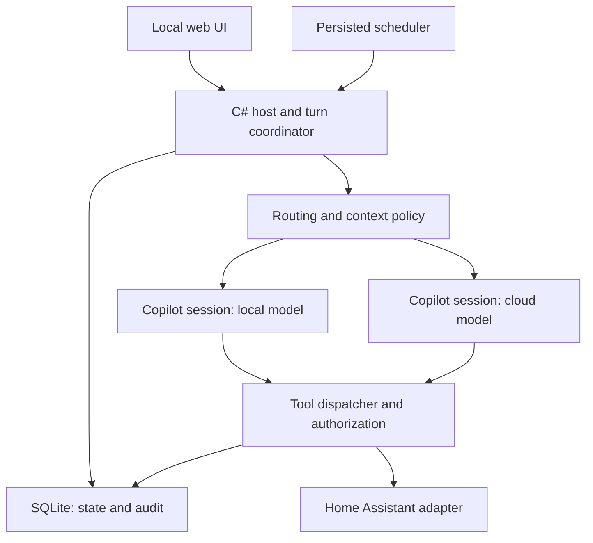

# Local-first personal assistant — development specification

Version: 0.4 · 2026-10-05 · Status: proposed implementation baseline

Revision 0.2 made Aspire the development orchestration baseline and added an enforceable agentic development workflow. Revision 0.3 records the owner's accepted agentic implementation/review policy: specifications and acceptance evidence, rather than owner manual inspection of generated code, govern acceptance. Sections 18–21 and the companion AGENTS.md define the detailed requirements. They supersede the abbreviated workflow guidance in section 15.

Revision 0.4 reorganizes the remaining backlog into chronological, runnable
milestones at the owner's request. Each task has exactly one milestone and is
completed within it. Product scope, accepted ADRs and validation gates are
unchanged; legacy cross-milestone tasks are replaced by separately closable tasks.

## 1. Purpose and decisions

Build a personal assistant that runs on an owner-controlled computer, remembers explicitly supplied household facts, uses Home Assistant through narrowly defined tools, performs persisted scheduled tasks, and consults a cloud model when a task warrants it. The host application is C#; GitHub Copilot SDK supplies the agent execution engine. Local model inference is initially through Ollama. Home Assistant is the device integration layer. The initial deployment target is an Apple Silicon Mac; support Linux development and deployment as well.

The owner is an experienced C# developer who values understandable configuration and reliable upgrades. Operational predictability takes priority over the number of integrations. Do not introduce OpenClaw, a second agent framework, or a distributed platform to complete the MVP.

Committed decisions:

- C# application with ASP.NET Core and .NET Generic Host.
- C# Aspire AppHost and ServiceDefaults for development orchestration, dependency configuration, local diagnostics and distributed test environments. Do not introduce extra services merely to use Aspire.
- GitHub Copilot SDK behind an application-owned adapter; the SDK runtime is a dependency, not the owner of household state.
- Ollama local inference plus a configurable cloud BYOK provider. Use separate execution sessions for local and cloud routes.
- SQLite owns conversations, memory, approvals, action records, jobs and audit events.
- One owner account initially; one active turn per conversation.
- Local web UI, server-side rendered with minimal JavaScript; use Razor Pages and server-sent events (SSE). No SPA framework required.
- Text first. Voice, physical endpoints, email, calendar and browser automation are later extensions.
- No autonomous purchases, messages to other people, lock/alarm/garage operations, or arbitrary shell execution in the MVP.
- No autonomous self-updates or configuration changes. Credentials never appear in model prompts or tool results.

Working name: PersonalAgent. This is a repository identifier, not a branding decision.

## 2. Outcome and scope

### MVP user stories

1. Ask “What is the temperature upstairs?” and receive sensor-derived information with the observation time, or an explicit unavailable/stale result.
2. Ask “Turn on the porch light.” Execute only if the entity resolution is unambiguous, the entity is allowed, and policy permits the operation. Verify the resulting device state where available.
3. Ask “Remember that the bathroom paint is Example Blue.” Preview and store a durable fact locally; retrieve it in a later conversation after a restart.
4. Edit or delete a remembered fact in the UI. Conflicting facts must not silently overwrite one another.
5. Ask a difficult question, choose “Use cloud,” review the exact context that will be sent, and receive an answer with a visible cloud route indicator.
6. Ask “Remind me tomorrow at 9 AM to check the furnace filter.” Preview the resolved local date/time and create a persisted job. It survives restarts and appears in the local notification inbox.
7. Approve a proposed medium-risk device action through a trusted UI control. Rejecting, expiring or changing it prevents execution.
8. Inspect a turn’s route, tool activity, approvals and outcomes without seeing secrets in the audit view.
9. Restart or upgrade the application without losing configuration, credentials, memory or jobs, and without repeating a possibly completed device action.

### Later, explicitly outside MVP

- ESPHome/Assist voice endpoints and local speech processing.
- Home Assistant history-based diagnosis, document ingestion and semantic retrieval.
- Email/calendar integrations, outbound notifications and account OAuth.
- Coding/browser agents with dedicated sandboxes.
- Learned routing, model critics, speculative decoding and multi-agent execution.
- Multiple household identities and per-person memory/access controls.
- Geolocation, cameras, finance, purchases and security-device control.

MVP scope does not assume existing Home Assistant installation or specific real entity IDs. Ship a simulator and fixtures so development requires no access to the owner’s house.

## 3. Architecture and ownership

The host owns identity, prompts, configuration, routing, context selection, tool registration, action approvals, memory, schedules, retry policy and durable state. The SDK owns generation, its agent loop and ephemeral runtime/session machinery. Home Assistant owns device integration and current physical state.

SDK session IDs are optional implementation details stored alongside a conversation. Application conversation IDs remain stable if SDK session state becomes incompatible or is deleted. SDK sessions may be reconstructed from bounded application context. No migration may require extracting household memory from an SDK transcript.

Use one controlled runtime initially if the SDK supports isolated providers and sessions reliably; otherwise use separate local/cloud runtime processes. M0 must establish the isolation behavior. Model selection is configuration, not hard-coded model names.

### Suggested solution layout

| Project | Responsibility |
|---|---|
| PersonalAgent.Domain | IDs, records, statuses, policy types; no SDK or persistence dependency |
| PersonalAgent.Application | Turn coordination, routing, approvals, memory and job use cases |
| PersonalAgent.Infrastructure | SQLite, secrets, Home Assistant, Copilot adapter, scheduler |
| PersonalAgent.Web | Razor Pages, authenticated APIs, SSE, hosting and composition |
| PersonalAgent.AppHost | Aspire composition, profiles, resource dependencies and test topology |
| PersonalAgent.ServiceDefaults | Shared hosting/health/telemetry defaults; no domain behavior |
| PersonalAgent.UnitTests | Domain and application behavior tests |
| PersonalAgent.ArchitectureTests | Project-reference and compiled dependency rules |
| PersonalAgent.IntegrationTests | SQLite, adapters and in-process HTTP integration tests |
| PersonalAgent.SdkContractTests | Pinned Copilot runtime and adapter contracts |
| PersonalAgent.E2ETests | Aspire-hosted API and Playwright browser acceptance tests |
| PersonalAgent.TestSupport | Shared deterministic fixtures and simulators; test-only dependency |

Use feature folders within projects. Avoid one project per feature or interface. Pin the .NET SDK in global.json and NuGet versions centrally. Target .NET 10 LTS if supported by the selected SDK package; confirm platform/package compatibility in M0. Commit a dependency lock and exact Copilot runtime version/override. No floating package versions.

T01 confirmed the .NET 10 target. The current `global.json` is the authoritative
exact .NET SDK pin for subsequent tasks, including T02; do not restore an older
pin from historical task or issue evidence. Keep CI and container SDK pins
aligned when refreshing the toolchain, and validate compatibility before
adopting a new pin.

## 4. SDK validation milestone (M0)

Before building feature infrastructure, create a minimal executable spike using a pinned release of GitHub.Copilot.SDK. Read the exact release documentation and record package/runtime versions in docs/sdk-validation.md. Do not copy unverified API signatures from this specification.

Demonstrate:

1. Local BYOK session against Ollama without GitHub login or inherited Copilot credentials.
2. A custom read-only tool is actually invoked and its result is returned to the model.
3. A cloud BYOK session works when explicitly configured; use mocked contract tests in normal CI and an opt-in live smoke test. Live credentials are supplied by the owner separately.
4. Built-in file, shell, web/network, installation and other unapproved tools are unavailable or deterministically denied. Model-requested subagents cannot broaden permissions.
5. Application-supplied instructions and session configuration do not inherit unrelated user/workspace instructions, MCP servers, skills or personal Copilot configuration. Test with deliberately hostile ambient configuration.
6. Local and cloud sessions have isolated transcripts and no implicit provider fallback. Local-only work does not silently reach GitHub-hosted models or hosted helper models.
7. Streaming, completion, cancellation, timeouts, runtime crash, restart and disposal can be handled without duplicate completion or hanging tasks.
8. Runtime launch uses a dedicated data directory and sanitized child environment. Inspect telemetry defaults, outbound destinations and any non-inference network activity. Document what can be disabled and any remaining limitations.
9. Determine whether turn/tool budgets, runtime prompt/context handling and complete cancellation are enforceable through the pinned SDK. Where an SDK limit is unavailable, enforce it through the coordinator/dispatcher and terminate the affected isolated runtime if needed.

Use a network capture or instrumented proxy for the local-only smoke test. Dependency downloads during installation are distinct from runtime inference traffic. Do not claim air-gapped operation from an API setting alone.

Deliver a go/no-go report. The expected path is Copilot SDK. If isolation, tool restriction or bounded cancellation cannot be established, stop dependent work and propose a scoped alternative; do not quietly substitute another framework. M0 does not require real household writes.

## 5. Core application contracts

The following are application contracts, not claims about SDK API names. Freeze the initial versions in task T02 before parallel feature development. Concrete records should carry strong IDs and CancellationToken support.

| Contract | Required behavior |
|---|---|
| IAgentEngine | Run a bounded turn from explicit provider, instructions, selected context and tool catalog; stream typed events; cancel; report terminal outcome |
| IModelRouter | Return Local, Cloud, Clarify or Unsupported with deterministic reason codes and the applied policy version |
| IContextBuilder | Produce an inspectable context packet with provenance and privacy classifications |
| IToolDispatcher | Validate, authorize, journal, execute and verify a registered tool call |
| IApprovalService | Create and resolve exact-action approvals; enforce owner identity, expiry and single use |
| IMemoryStore | Search/get/create/update/delete facts with provenance and optimistic concurrency |
| IConversationStore | Persist messages, turns and event sequence; rebuild bounded context |
| IJobStore / IJobRunner | Persist due jobs, claim leases, recover interrupted runs and record outcomes |
| IHomeAssistantClient | Typed entity snapshots and narrowly mapped service operations; fake implementation supplied |
| ISecretResolver | Resolve named references without exposing secret values to application presentation/model layers |
| IClock | UTC time and controllable test clock |

Agent events: TurnStarted, RouteSelected, ContextReviewRequired, TextDelta, ToolProposed, ApprovalRequired, ToolCompleted, TurnCompleted, TurnFailed, TurnCancelled. Persist monotonic event sequence numbers for UI reconnection; ephemeral token deltas may be compacted after a final message is saved.

Turn lifecycle: Received → Routing → ContextReview (optional) → Running → WaitingForApproval (optional) → Running → Completed/Failed/Cancelled/Interrupted. Terminal status changes use compare-and-swap semantics. Waiting turns release inference resources where possible; durable proposals must not depend on keeping a tool callback alive indefinitely.

## 6. Model routing and cloud context

### Route modes

| Mode | Rules |
|---|---|
| LocalOnly | Never invoke a cloud model or disclose context to one. If capability is inadequate, return a limitation or clarification. |
| AskBeforeCloud (default) | Work locally when supported. Any cloud invocation requires reviewing the packet and explicit consent. |
| CloudAllowed | Allow cloud within the owner’s configured purpose, privacy and spending limits; show every transition. |

Mode selection is an authenticated UI setting, not a tool the model may change. Any content labelled LocalOnly blocks cloud disclosure unless the owner explicitly reclassifies that content in a separate UI action. CloudAllowed does not override LocalOnly labels.

MVP automatic routing is conservative. User-selected model route is authoritative within privacy policy. Deterministic route rules recognize registered workflows and explicit task categories; unsupported or ambiguous requests ask for clarification. Do not pretend a keyword classifier can reliably detect every hard problem. Keep complex general tasks behind explicit cloud choice until evaluation supports broader routing.

Escalation signals: unknown tool/entity, failed schema/domain validation, repeated equivalent failed attempts, task-specific verifier failure, exhausted step/time budget, or explicit user escalation. Local model self-reported uncertainty may suggest escalation but cannot authorize it or guarantee correctness. Valid syntax and agreement between repeated model samples are not proof of intent or correctness.

Cloud escalation starts a fresh session with a new, minimal packet. Do not send the full local transcript, unfiltered memory or raw SDK session. MVP cloud sessions have no direct household read/write tools; the packet contains selected evidence already collected locally. Cloud answers may suggest actions, but executing one goes through a new local action proposal and policy evaluation. Never replay completed side effects during escalation.

### Cloud packet schema (conceptual)

- Purpose and task statement.
- Selected observations/facts: value, units, observedAt, sourceId, privacy classification.
- Explicit constraints and necessary bounded conversational context.
- Requested output and supported next-step types.
- Packet ID, schema version, route policy version, content hash and consent ID.

Every selected item has provenance. Use structured selection and allowlists; regex redaction is supplementary and does not guarantee anonymity. Show the actual task text as well as selected facts in the review UI. Consent binds to the packet hash and provider; modification requires fresh review. Context limit estimates must include tool schemas and system instructions; use provider tokenizers where available, otherwise mark estimates and reserve margin.

## 7. Tools and action authorization

Expose capabilities through host tools, never generic HTTP, shell or arbitrary Home Assistant service execution. Each registration declares name, input schema, side-effect class, entity/resource restrictions, validation, execution, verification and idempotency characteristics.

Initial tool set:

| Tool | Behavior and limits |
|---|---|
| home.list_entities | Return approved entities, friendly names, areas, units and supported operations only |
| home.get_state | Read an approved entity; return timestamp and availability |
| home.set_light | Set an approved light on/off; optional brightness only with configured bounds |
| home.set_temperature | Feature-gated; set an approved thermostat within configured bounds; approval always required initially |
| memory.search / memory.get | Search permitted local facts with provenance; bounded results |
| memory.propose_change | Create a memory mutation proposal; host/UI confirms before committing |
| reminders.propose | Propose a persisted reminder with exact resolved time, time zone and message |

Aliases must resolve uniquely. “Upstairs” or “porch” with multiple matches triggers clarification; the model cannot select an arbitrary entity. Broad entity patterns must not accidentally admit locks, alarms, switches controlling appliances or garage covers. Use an explicit entity-to-operation allowlist.

Risk policy:

- ReadOnly: automatic for approved resources.
- LowRiskWrite: explicit requested light operation may execute automatically when allowed and unambiguous.
- ApprovalRequired: thermostat changes, scheduled device writes (later), and all supported medium-risk operations require an exact proposal.
- Unsupported: security devices, purchases, outbound messages, arbitrary services, shell, installations and unsupported physical actions.

Tool implementations perform authorization independently of SDK permission callbacks. No globally approving permission handler in the shipped application. Credentials stay inside the adapter and are not included in observations, diagnostics or errors.

Approval record binds owner, action type, canonical arguments, resolved entity, relevant policy/config version, request provenance and expiry. Default expiry: five minutes. Approval does not grant permanent authority or approve a batch of hidden actions. Recheck policy and freshness at execution; changed target/arguments require a new proposal. User approval is a trusted UI event, never inferred from model text or a document saying “approved.”

### Actions and retry semantics

Persist a prepared action before external execution. Record action ID, canonical request hash and status: Prepared, AwaitingApproval, Executing, Succeeded, Failed, Unknown, Rejected or Expired. Duplicate dispatch of the same action ID returns the recorded outcome; unrelated later user requests are not deduplicated just because their arguments match.

A network timeout after sending a service call is Unknown, not safely failed. If the target state can be observed, reconcile it; observation may confirm current state but does not prove which request caused it. Do not blindly retry. Home Assistant and SQLite do not form one transaction; do not promise exactly-once physical execution. Apply verification windows and bounded polling. Report “command accepted, state unconfirmed” separately from verified success.

## 8. Home Assistant integration

Use documented REST endpoints for entity reads/service operations initially. WebSocket subscriptions are optional after MVP; no persistent connection is required for initial correctness. Calling a service is distinct from updating the Home Assistant state representation; never use the state-update endpoint as a substitute for controlling a real device.

Configure base URI, named token reference, approved entity catalog, aliases, per-operation bounds, request timeout and verification window. The configured base URI is trusted administrator configuration and must never be overridden by model output. Use a dedicated account/token where feasible; application allowlists remain necessary and are not a claim that Home Assistant itself offers granular entity-scoped tokens.

Adapter distinguishes unavailable, stale, unauthorized, unknown entity and transport failure. Include source timestamp in sensor answers. Avoid inventing data. Ship a deterministic fake with fixtures for lights, thermostat and sensors, including duplicate aliases, stale readings, timeouts and state changes.

## 9. Memory and conversation state

MVP memory is explicit structured facts plus SQLite full-text retrieval; no vector database, embedding service or automatic personality profiling is required.

MemoryFact: Id, ownerId, subject, key, value, sourceMessageId/sourceType, createdAt, updatedAt, version, privacyClass, validity status and optional supersedesId. Provenance references must remain meaningful after permitted transcript deletion; define whether the reference is redacted or removed.

Mutations require owner confirmation. Search returns citations to fact IDs and last-updated times. Conflicts produce a proposal to supersede or retain both with distinguishing context. Retrieved material is evidence, never executable instructions or authorization. Do not automatically save inferred medical, relationship or other sensitive facts.

Conversation history and durable facts are separate. Long-term memory is selected by relevance and privacy constraints, not injected wholesale. MVP use recent message bounds plus stored facts; do not require automatic summary generation. If summaries are added, preserve source links and mark them model-generated. Local summaries remain local unless specifically selected for a cloud packet.

Deletion removes active facts, FTS entries and approved derived context/caches, and invalidates pending packets containing those facts. Explain that configured backups can retain older versions until expiration. Do not claim secure erasure of SQLite pages or backups from a logical deletion. Choose a documented retention policy; default audit retention 30 days, normal conversation retention 90 days, durable facts until deletion. Owner can change these.

## 10. Scheduling

MVP supports one-time reminders and recurring reminder schedules, not autonomous device control. Store jobs in SQLite; a hosted worker claims due jobs with a lease and executes deterministic handlers. Do not leave an LLM running or a Task.Delay alive for hours as the scheduler.

Job: Id, ownerId, kind, payloadVersion, payload, timeZoneId, dueAtUtc/recurrence definition, enabled, misfire policy, leaseOwner, leaseExpiry, attempt count and outcome. JobRun: jobId, scheduledOccurrence, status, timestamps, notificationId and error. Unique constraint on jobId + scheduledOccurrence prevents duplicate reminder materialization.

Default time zone: America/Los_Angeles. All persisted instants are UTC. Display both the user’s local time and zone before creation. Resolve nonexistent DST times by asking; ambiguous times require choosing an offset. Recurrence follows local wall time, not a fixed 24-hour UTC interval. Inject IClock in tests.

Default one-time reminder misfire: create one delayed notification on restart, labelled with its original due time. Recurring misfire: coalesce missed occurrences into one notification with count/original range; preview this behavior in settings. Job creation uses a stable client request ID so UI retries do not create two jobs. Notifications are local durable inbox records; no guaranteed phone push in MVP.

## 11. Storage, configuration and upgrades

Suggested SQLite tables: Conversations, Messages, Turns, TurnEvents, MemoryFacts (+ FTS), MemoryProposals, ApprovalRequests, Actions, Jobs, JobRuns, Notifications, CloudConsents and AuditEvents. Use foreign keys, transactional state changes, versioned migrations, WAL where appropriate and optimistic concurrency. Do not distribute writes over multiple machines.

Use appsettings.json/environment variables for declared configuration plus named secret references. Owner-facing edits validate before applying and preserve last-known-good settings. Persisted data lives outside the deployment folder. App-owned SDK state lives in a separate subdirectory. Do not inherit the user’s ordinary Copilot home or workplace credentials. No self-modifying config tools.

Secrets: development user-secrets are acceptable; deployed mode uses an OS-supported secret store or an owner-provided protected file/reference mechanism. Do not imply .NET user-secrets encrypts values. Cloud and Home Assistant secret resolution occurs server-side. Encryption at rest is a deployment decision; document the reliance on disk encryption and file permissions rather than claiming encrypted SQLite by default.

Upgrade procedure: pin dependencies; back up through SQLite’s backup facility or a safe stopped-service snapshot; run migrations on a copy in CI; validate; swap application binaries; preserve external data/config/secret references; perform health checks. Schema downgrades are not automatic: rollback restores a matched backup and previous binary. Restore requires stopping workers so actions/jobs cannot run concurrently. Recovery preserves Unknown action status and never replays it automatically.

## 12. Host API and UI

Bind to loopback by default. Use an authenticated owner session with HttpOnly/SameSite cookies and CSRF protection for mutations. Initial bootstrap uses a one-time locally displayed setup token to create the owner account; do not place reusable credentials in URLs. Remote/LAN access is opt-in and requires documented TLS, authentication and network setup. Do not expose a public unauthenticated listener.

Proposed API surface:

- POST /api/conversations; GET /api/conversations/{id}
- POST /api/conversations/{id}/turns with requestId, text and routeMode
- GET /api/turns/{id}/events (SSE, resume with event ID)
- POST /api/turns/{id}/cancel
- GET /api/approvals; POST /api/approvals/{id}/decision with expectedVersion
- GET /api/cloud-context/{packetId}; POST /api/cloud-context/{packetId}/consent
- GET/POST/PATCH/DELETE /api/memory (typed mutation proposals; versioned updates)
- GET/POST/PATCH/DELETE /api/jobs; GET /api/notifications
- GET /api/audit; GET /health/live; authenticated GET /health/ready

Every object lookup checks owner identity; hiding IDs is not authorization. Return structured errors with correlation IDs and safe messages. Duplicate client request IDs return the original resource. Enforce text/payload limits and bounded SSE buffers; slow clients cannot stall tool execution indefinitely.

UI pages: Chat, Pending approvals/context reviews, Memory, Reminders/notifications, Activity, Settings. Show Local/Cloud route, provider/model, observations and their times, execution status and approval details. Settings show references/connection status, never resolved credentials. Support cancelling turns and reconnecting to an interrupted event stream. Keep infrastructure details in Settings/Activity, not routine conversation replies.

## 13. Operational limits and observability

Initial defaults, configurable with validation:

- One active turn per conversation, maximum four active turns globally; bounded queue of 20.
- At most eight tool dispatches per turn; reject repeated identical failed calls after two attempts.
- Interactive turn deadline 120 seconds, provider/model-specific override permitted.
- Read requests: one transient retry within deadline; writes: no retry after uncertain submission.
- Approval deadline five minutes, separate from generation deadline.
- One cloud escalation per task initially.
- Cloud disabled until configured; spending and token limits required before unattended CloudAllowed work. Use reported usage when available, conservative reservations when absent, and label estimates. No precise dollar guarantee without reliable provider usage/pricing.

Readiness: database/migrations, policy, runtime and configuration availability; model connectivity reported separately. Provider outage should not disable memory/reminder UI. Graceful shutdown stops accepting turns, cancels generation, releases/records leases and journals interrupted actions. Cancellation cannot undo an already sent physical action.

Structured logs carry conversationId, turnId, actionId, jobRunId and reason codes. Operational audit records routes, packet consent/hash, tool request/outcome, approvals, config changes and migrations. Do not log prompt bodies, sensor histories or provider payloads by default. Sensitive debug capture is explicit, local and expiring. Sanitize SDK child-process output before storage/display. Hosted tracing/telemetry is opt-in; validate runtime behavior in M0. Audit is useful history, not cryptographically tamper-proof evidence.

## 14. Acceptance and evaluation

CI must run without real models, cloud credentials or household connections. Supply a deterministic IAgentEngine fake plus an instrumented fake model endpoint for SDK contract tests. Live model tests are separately tagged and never invoked by default.

| Scenario | Required result |
|---|---|
| LocalOnly request tries to escalate | No cloud invocation, including helper/summary calls; limitation shown |
| Cloud packet contains LocalOnly fact | Packet blocked; omission/reclassification handled explicitly |
| Approved packet is modified | Consent invalidated; new review required |
| A malicious fact requests shell execution | Treated as data; shell unavailable/denied |
| Model requests unregistered tool or disallowed entity | Dispatcher denies; no external request |
| Two porch entities match | Clarification; neither is controlled |
| Light action repeated with same action ID | One dispatch; recorded result returned |
| Service call times out after sending | Unknown status; reconciliation, no blind replay |
| Approval is expired, replayed or changed | No execution |
| Owner cancels while action is already sent | Report truthful outcome; do not claim rollback |
| Crash after job lease claim | Lease recovery and one inbox notification per occurrence |
| DST ambiguous/nonexistent reminder | Exact resolution required; recurrence remains wall-clock based |
| Memory survives runtime session loss | Facts remain retrievable from application store |
| Configuration/credentials survive upgrade | Same references and values; no unintended login or reset |
| SDK process crashes | Turn terminates/reports interruption; other app features remain usable |
| Event stream reconnects | Ordered events without duplicated actions or final messages |
| Unauthorized/CSRF mutation | Rejected; no state mutation |
| Logs capture simulated secrets | Test fails unless values are redacted |

Create an evaluation set of at least 30 representative requests: household reads, ambiguous entities, light operations, reminders, memory conflicts, cloud consent, unsupported actions and adversarial retrieved content. Include expected route/tool/outcome, not just expected prose. Run selected local models against the set before enabling automatic writes. Any observed disallowed action blocks release; report tool accuracy, clarification rate, verified outcomes, cloud disclosure decisions and latency. Do not claim broad safety from passing a small benchmark.

Definition of done: runnable simulator demo; build and CI tests pass; critical SDK isolation contract tests pass; docs cover setup, secrets, upgrades, backup/restore and limitations; no unimplemented success paths; real integrations have opt-in smoke procedures; versions are pinned.

## 15. Agent-ready implementation backlog

Execute milestones in order: M0, M1, M2, M3, M4. Close the current milestone
only after all its tasks, its cumulative demo and its applicable checks pass.
No task remains open for work in a later milestone. A dependency on a completed
earlier milestone is a prerequisite, not a second parent.

T01-T04 retain their historical IDs and completed records. Remaining tasks use
milestone-local IDs: M1-01, for example, belongs only to M1. The table gives the
recommended serial order; independent tasks may run in parallel only after their
explicit prerequisites are satisfied and ownership is isolated. The integration
owner controls shared contracts, schema and composition. These are development
tasks, not runtime multi-agent features.

| Milestone | ID / issue | Deliverable and ownership | Prerequisites |
|---|---|---|---|
| M0 | T01 / #2 | SDK spike, pinned versions, isolation/tool/cancellation evidence and go/no-go | None |
| M1 | T02 / #3 | Aspire scaffold, frozen contracts, architecture/CI enforcement and documentation skeleton | M0 closed |
| M1 | T03 / #4 | SQLite persistence, migrations, concurrency and backup/restore primitives | T02 |
| M1 | T04 / #6 | Isolated Copilot adapter, explicit providers, streaming/cancellation and actual-runtime contracts | T02 and M0 |
| M1 | M1-01 / #7 | Local-only routing and bounded context; cloud denial; Application routing/context | T03, T04 |
| M1 | M1-02 / #12 | Local turn use case, durable lifecycle, limits, cancellation, recovery and production composition | M1-01 |
| M1 | M1-03 / #11 | Owner bootstrap/auth, chat APIs/UI/SSE, local settings/activity and runnable chat demo | M1-02 |
| M2 | M2-01 / #5 | Tool dispatcher, exact approvals, authorization and durable action journal | M1 closed |
| M2 | M2-02 / #8 | Typed Home Assistant REST adapter, one bounded transient safe-read retry, controlled fixtures and home tools | M2-01 |
| M2 | M2-03 / #9 | Confirmed memory proposals, FTS retrieval, conflicts, deletion and memory tools | M2-01 |
| M2 | M2-04 / #29 | Household/memory/approval UI, local coordinator integration, audit and runnable M2 demo | M2-02, M2-03 |
| M3 | M3-01 / #30 | Cloud route matrix, exact packets, persisted consent, privacy invalidation and budgets | M2 closed |
| M3 | M3-02 / #10 | Reminder proposals, scheduler/leases, DST/recurrence/misfires and durable inbox | M2 closed |
| M3 | M3-03 / #31 | Cloud review and reminder UI/APIs, coordinator/worker integration and runnable M3 demo | M3-01, M3-02 |
| M4 | M4-01 / #32 | Complete MVP scenario evidence, operational limits, failure/recovery and cumulative demo | M3 closed |
| M4 | M4-02 / #13 | Deployment, upgrade/restore rehearsal, evaluation, protection proof and pilot readiness | M4-01 |

Scope migration preserves all original acceptance obligations:

| Legacy task | Replacement ownership |
|---|---|
| T05 | M1-01 owns local-only routing/context; M3-01 owns cloud policy/consent/budgets |
| T06, T07, T08, T09 | M2-01, M2-02, M2-03, M3-02 respectively |
| T10 | M1-03 owns chat/auth/SSE; M2-04 owns household/memory/approval UI; M3-03 owns cloud/reminder UI |
| T11 | M1-02 owns local coordination; M2-04 and M3-03 own their feature integration; M4-01 owns complete acceptance evidence |
| T12 | M4-02 owns release readiness |

Each task's issue defines its own tests, documentation, exclusions and completion
criteria. Write its implementation brief under `docs/tasks/` before coding.
Milestone demo tasks exercise production composition using deliberate controlled
adapters/endpoints, not success stubs. Their implemented acceptance scenarios and
required checks must pass before closure; M4 is not permission to defer working
features, security, documentation, coverage or independent review.

Task handoff template:

> Read Personal-Agent-Project-Spec.md and the merged contract ADRs. Implement only the assigned task, using its exact ID from the backlog table (for example, M1-01 for a remaining task or T02 for a historical foundation task). Own the listed files; coordinate any contract/schema change with the integration owner before editing shared surfaces. Use the pinned SDK documentation rather than inventing API signatures. Supply tests for the task’s failure modes, a runnable demonstration where applicable, and a short report of changes, validation and remaining limitations. Use fake providers/devices unless explicitly authorized to use live services. Do not add another agent framework or expand product scope.

### Bootstrap prompt for the lead development agent

> Create a new C# PersonalAgent repository implementing the attached specification and AGENTS.md. Start with T01, the Copilot SDK feasibility spike; do not build the full product before validating local inference, provider isolation, tool restriction and cancellation. Then complete T02: use a C# Aspire AppHost, freeze application contracts, and establish architecture, coverage and E2E CI gates before parallel feature development. Plan dependency-aware assignments using the backlog, with one integration owner responsible for shared contracts and composition and an independent reviewer for every implementation PR. Keep household state in application-owned SQLite, expose only approved Home Assistant tools, and require inspectable consent before cloud disclosure in the default mode. Implement small reviewable slices with meaningful tests and current project/API documentation; pin runtime/dependency versions. If a necessary SDK capability cannot be enforced, present the concrete blocker and a scoped alternative rather than silently changing the stack. Do not access real devices, send messages, deploy publicly or use work credentials without explicit authorization.

### Suggested repository AGENTS.md content

The companion AGENTS.md is the canonical detailed instruction file to copy into the repository root. The list below is an abbreviated summary; implement sections 18–21 as CI checks, not just prose instructions.

- Treat this specification and accepted ADRs as the source of truth; flag conflicts before implementation.
- Do not widen tool privileges or cloud disclosure to make a test pass.
- Never use ApproveAll for production sessions; validate permissions inside tool implementations.
- Do not introduce runtime MCP/skill installation, arbitrary HTTP tools, shell, browser or outbound messaging in MVP.
- Preserve application IDs/state independently of Copilot runtime/session files.
- All external calls support cancellation/timeouts; physical writes have explicit uncertain outcomes.
- Keep SDK types inside its adapter. Use strong application records at boundaries.
- Dependency and runtime versions are pinned; no auto-updates.
- Normal tests use fake engines/devices and no external credentials.
- A passing mocked test is not evidence of a supported SDK behavior; retain the SDK spike/contract tests.
- Do not change shared contracts or database schema concurrently without integration-owner coordination.
- Each handoff reports actual tests run, unresolved assumptions and scope changes.

## 16. Milestones and release boundaries

Each milestone is a cumulative runnable increment. Complete and close it before
starting the next. The task list in section 15 is the exclusive membership list;
there are no shared tasks or deferred portions of a closed task.

| Milestone | Runnable demo at closure | Exit gate |
|---|---|---|
| M0: SDK Validation | Run the SDK harness: controlled tool invocation, denial, explicit provider isolation and bounded cancellation | T01 evidence/go decision and pinned versions; no product-service claim |
| M1: Local Chat | Launch Aspire, authenticate, chat with streamed local responses, reconnect/cancel, restart and reopen durable history | T02-T04 and M1-01 through M1-03 complete; Simulator API/browser flows and applicable mandatory gates pass; no cloud or household writes |
| M2: Home Assistant & Memory | Repeat M1; read a timestamped simulated sensor, control an allowed simulated light, approve/reject a gated proposal, remember/retrieve/edit/delete a fact after restart and inspect audit | M2-01 through M2-04 complete; entity/approval/Unknown-outcome/privacy and cumulative M1/M2 scenarios pass |
| M3: Cloud Consent & Reminders | Repeat M2; review the exact context, consent to an isolated controlled cloud answer, confirm a reminder, restart and receive one durable inbox notification | M3-01 through M3-03 complete; consent/budget/no-replay and scheduler/DST/recovery scenarios pass; all nine MVP stories implemented end-to-end |
| M4: Release Readiness | Run the full demo plus failure/restart and matched upgrade/restore rehearsals using the documented deployment path | M4-01 and M4-02 complete; full scenario matrix, required checks, protection proof, evaluation and independent review dispositions support owner acceptance |

Required demos and CI use controlled endpoints, isolated data and no household
or cloud credentials. The Local profile provides native Ollama wiring at M1;
live local-model runs remain opt-in and must be identified separately from
deterministic simulator and actual-runtime contract evidence. M2 provides opt-in
Home Assistant smoke guidance; M3 provides opt-in cloud smoke guidance. Never
describe a simulated observation or response as a live result.

M4 prepares an owner pilot; it does not require physical writes or public
deployment. Run and record the selected-local-model evaluation before the pilot
or enabling automatic writes, as required by section 14. Live credentials,
cloud disclosure and device writes require explicit consent. An unavailable
required check blocks its existing gate; this reorganization waives none.

Pilot in read-only mode first; enable individual allowed light operations after verifying behavior. This is an implementation sequencing choice, not a request for repeated approval of ordinary development. All non-MVP integrations require a new scoped specification.

## 17. Sources and verification notes

Reviewed 2026-10-03. Product APIs evolve. T01 must recheck documentation for the exact selected package/runtime. The application design above is a proposal, not a claim that the SDK provides every listed feature directly.

1. GitHub Copilot SDK architecture and repository: https://github.com/github/copilot-sdk
2. .NET SDK API, provider/session configuration, tool availability and permission handling: https://github.com/github/copilot-sdk/blob/main/dotnet/README.md
3. GitHub SDK BYOK and local provider guidance: https://docs.github.com/en/copilot/how-tos/copilot-sdk/auth/byok
4. Home Assistant REST API (states and service calls): https://developers.home-assistant.io/docs/api/rest/
5. Home Assistant WebSocket API (future subscriptions): https://developers.home-assistant.io/docs/api/websocket/
6. Local Assist pipeline (future voice): https://www.home-assistant.io/voice_control/voice_remote_local_assistant/
7. ESPHome voice component (future endpoints): https://esphome.io/components/voice_assistant/
8. Aspire testing and out-of-process topology: https://aspire.dev/testing/overview/
9. Aspire distributed test setup: https://aspire.dev/testing/write-your-first-test/
10. Aspire C# ServiceDefaults: https://aspire.dev/get-started/csharp-service-defaults/
11. Aspire Ollama integration and documented container GPU paths: https://aspire.dev/integrations/ai/ollama/ollama-host/
12. .NET coverage collectors/platform compatibility: https://learn.microsoft.com/en-us/dotnet/core/testing/microsoft-testing-platform-code-coverage

Open decisions to resolve during implementation, without changing the baseline: exact SDK/runtime versions, deployment secret-store mechanism, cloud provider/model and cost limits, chosen local model/quantization/context size, exact HA entity catalog, backup location/retention, and remote access method. Default to simulator/local-only operation until owner configuration is supplied.

## 18. Aspire orchestration requirements

Aspire is mandatory for the normal development entry point and distributed acceptance testing. It is not an agent framework, a permissions boundary or the source of household state. Pin compatible stable Aspire packages/tooling with .NET and Copilot versions in T02; document exact launch commands and prerequisites. Use a C# AppHost project rather than a TypeScript AppHost.

### Resource model

| Component | Aspire treatment | Lifecycle owner |
|---|---|---|
| PersonalAgent.Web | Project resource with health/status, endpoints and references | AppHost during development; normal service launcher when deployed |
| SQLite | Persistent file path/configuration; no database server container | Application storage subsystem |
| Ollama on Apple Silicon | Declared external endpoint/parameter by default | Native Ollama service managed separately |
| Home Assistant live | Declared external endpoint plus protected secret reference | Owner’s existing HA installation |
| Cloud provider | Configured external provider and secret reference; no local proxy required | Application provider adapter |
| Copilot runtime | Child runtime beneath host; expose safe status/metrics | IAgentEngine adapter, not a second independent AppHost launcher |
| Fake HA/model endpoints | Managed project/executable resources for simulator/E2E | AppHost test profile |

Do not create a PostgreSQL/Redis/RabbitMQ resource because Aspire supports one. SQLite remains the selected storage. Do not containerize the Web app or inference server on macOS if that compromises native runtime/GPU access. Container Ollama is an optional Linux profile only when GPU/backend support is demonstrated; do not assume a container’s GPU option provides Apple Metal acceleration.

Required profiles:

- Simulator: no credentials, real models or real devices. Deterministic fake engine and managed fake HA endpoint; isolated persistent development data.
- Local: native/external Ollama, optional approved HA endpoint, cloud disabled until configured.
- Hybrid: explicit local/cloud providers plus review policy; never silently enables cloud.
- E2E: isolated temporary database/data directory, random endpoints, deterministic fake dependencies and test clock scenario control. No live service references inherited from developer configuration.

Choose profiles via explicit trusted configuration. Test/simulator controls are unavailable in live profiles and cannot be selected by model input. Profiles must reuse the production composition and validators; replace only external dependencies through supported startup configuration. Out-of-process Aspire tests cannot replace arbitrary DI registrations after the application starts. Test dependencies must be real launched endpoints or deliberate profile-selected adapters.

Use service discovery/resource references rather than fixed ports for managed resources. External endpoints remain explicit parameters. Readiness must reflect required connections without blocking memory/reminders indefinitely when inference is offline. Keep AppHost resource readiness and application readiness distinct; a healthy web server is not proof a model can invoke a tool. Use bounded startup waits in tests, not arbitrary sleeps.

ServiceDefaults includes useful health checks, service discovery and local OpenTelemetry configuration, with privacy filtering. Review default HTTP resilience: automatic retries/hedging must not repeat physical writes, provider turns or non-idempotent operations. Put safe reads and unsafe writes behind different policies. Aspire dashboard is local/authenticated; do not expose it or its logs publicly. Local dashboard export is distinct from hosted tracing, which stays opt-in.

Ship both the canonical Aspire development command and a direct Web host deployment procedure. Aspire AppHost is not automatically a production supervisor for an always-on Mac. M4-02 records native service startup, restart behavior, external Ollama lifecycle and backup/restore. Optional publish/deployment support does not authorize public deployment.

Aspire acceptance: simulator launches from clean checkout; dependency endpoints are discovered; required readiness failures are visible; tests run simultaneously with separate data/ports; disposing the test host cleans up only resources it owns; stopping AppHost preserves real development data and does not stop external HA/Ollama; telemetry contains no simulated secrets or raw prompts; all profiles have documented prerequisites.

## 19. Enforced architecture and documentation

### Allowed application dependency graph

| Project | Allowed internal dependencies |
|---|---|
| Domain | None |
| Application | Domain |
| Infrastructure | Application, Domain |
| Web | Application, Domain; Infrastructure in composition/bootstrap only; ServiceDefaults for hosting |
| ServiceDefaults | None of Domain/Application/Infrastructure/Web |
| AppHost | Aspire project-resource references and composition metadata; no runtime business logic |
| Test projects | Only tested projects and TestSupport; production never references tests |

Domain/Application cannot reference ASP.NET Core, Aspire hosting, SQLite/EF, GitHub Copilot SDK or provider SDK types. Web page/endpoint handlers cannot directly instantiate database contexts, raw provider clients or HA clients; use application use cases. All GitHub.Copilot types remain under Infrastructure/AgentEngine/Copilot. AppHost may reference Web as an Aspire resource, which is an orchestration dependency and not a layer violation. No cycles, service locator pattern or model-generated code execution. Cross-cutting host configuration stays outside domain logic.

T02 must implement project-reference checks and compiled type/namespace dependency tests. Use a pinned architecture-testing library or a small assembly-metadata checker; select once and record the rationale. Verify the composition-root exception explicitly. Add negative fixtures proving a forbidden reference is rejected; do not introduce real violations into production to test the checker. Architecture checks run on every PR and changes to the checkers require independent review. A namespace rename must not bypass the SDK boundary rule.

Documentation deliverables:

- README.md: purpose, scope, prerequisites, simulator quick start, exact launch/test commands, known limitations and links.
- docs/architecture.md: component ownership, dependency graph, turn/action state transitions and privacy/trust boundaries.
- docs/adr/: short accepted decisions for important boundary, dependency, storage, migration and deployment changes; record rationale and alternatives, not every routine edit.
- docs/development.md: Aspire profiles, test layers, fixtures, debugging, quality gates and agent workflow.
- docs/operations.md: credentials/references, native Mac deployment, update, backup, restore, outages and Unknown action recovery.
- docs/testing.md: acceptance scenario IDs mapped to tests, optional live smoke tests and coverage scope.
- docs/tasks/: scoped task briefs/status and handoffs. No duplication of the complete architecture in each task.
- Every production project has a short README documenting its responsibilities, dependencies, public entry points and local test commands.

Public/protected production classes, interfaces and methods require XML documentation. Describe responsibilities, inputs/outputs, invariants, nullability, side effects and failure behavior where relevant. Use inheritdoc when the interface contract fully covers the implementation. Document cancellation semantics, uncertain physical outcomes, privacy classifications and approval requirements precisely. Private/internal code needs explanatory documentation for non-obvious policy, concurrency, recovery and algorithms; do not add comments that merely restate names. Public DTO properties document units, UTC/local-time semantics, IDs and allowed values when not self-evident.

Enable XML documentation generation and treat missing required public documentation warnings as build failures for first-party libraries. Test methods use behavior-oriented names, not boilerplate XML. Generated files may be excluded by explicit patterns. Link checking and Markdown validation run in CI. Update relevant docs in the same PR as behavior/configuration/API changes; reviewer checks semantic accuracy because a compiler cannot prove a comment is truthful.

## 20. Test and coverage gates

Use a pinned xUnit-compatible stack, Playwright for .NET browser tests and Aspire.Hosting.Testing for distributed tests. T02 chooses one compatible runner/coverage collector combination and demonstrates collection and threshold failures. Do not copy VSTest MSBuild coverage flags into an MTP setup without validating compatibility. All commands are reproducible through repository scripts in tools/; CI and agents invoke the same scripts. Provide POSIX shell scripts (tools/validate.sh) runnable on macOS/Linux, with prerequisites documented; PowerShell is not required.

Test layers:

1. Unit: policy, route/context rules, state transitions, time/DST, domain validation and concurrency decisions; no network, real clocks or filesystem dependency unless part of the tested behavior.
2. Integration: real SQLite and migrations, adapters against controlled HTTP endpoints, authenticated API tests through WebApplicationFactory, cancellation/recovery. Use a fresh database per test scope.
3. SDK contract: actual pinned runtime against a deterministic compatible endpoint when possible; optional local-model smoke. No reliance solely on a fake IAgentEngine to establish SDK behavior.
4. Aspire API E2E: actual host process, persistent stores and managed fake external endpoints; verify cross-process wiring, restart, consent, approvals and jobs over public APIs.
5. Browser E2E: Playwright drives real Razor UI through Aspire, including login, chat streaming, exact cloud packet review, approval/rejection, memory editing, reminder inbox and reconnect/cancel.
6. Live evaluations: opt-in local/cloud/device smoke and model dataset; separate from mandatory credential-free CI.

### Unavoidable interactive or live E2E evidence

Coding and independent review agents automate all agent-observable acceptance checks first and minimize owner interaction. When an accepted criterion requires evidence that automation or available agent access cannot obtain, identify the exact criterion, missing evidence, reason automation cannot cover it, and acceptance impact. Do not invent arbitrary manual tests or silently promote optional opt-in live evaluations to mandatory checks. Required acceptance evidence remains required; unavailable execution is unverified and blocks completion under the applicable gate. Owner acceptance of disclosed residual risk does not waive mandatory checks.

Prepare and run everything safely available to the agent. For unavoidable owner participation, provide safe concrete prerequisites, steps, expected measurable outcomes, stop conditions and cleanup. Obtain explicit consent before credential use, cloud disclosure or physical writes; never request secret values in chat or logs. Agents interpret privacy-redacted logs and measurable findings themselves, using `ask_user` only for consent, actions or observations they cannot obtain themselves. Record the exact revision, steps executed/unrun, measured results, owner-only observations, acceptance impact and residual risks in the task/PR handoff. This supports evidence-based owner acceptance, not manual code certification or a claim that unrun tests passed. See [testing guidance](testing.md#unavoidable-interactive-or-live-e2e-evidence) for the reporting procedure.

Coverage defaults below are requirements chosen for this project, not industry standards. Calculate covered/coverable counts, not the mean of project percentages. Missing reports or expected assemblies with no report fail the gate.

| Gate | Required coverage |
|---|---|
| Unit-only Domain and Application, each assembly | At least 90% lines and 85% branches |
| Combined unit + integration first-party runtime code | At least 85% lines and 75% branches overall; each runtime assembly at least 80% lines and 70% branches |
| Critical policy/context/approval/action/scheduler modules | At least 95% lines and 90% branches, plus all specified failure scenarios |
| Added/modified executable lines in first-party runtime code | At least 90% line coverage from unit/integration reports |
| E2E | All implemented acceptance scenarios pass; no numeric coverage substitute |

If a module has no coverable branches, branch threshold is N/A with counts reported. Web composition, generated Razor/compiler code, migrations generated by tools, test assemblies, AppHost and untouched template ServiceDefaults may have narrowly documented exclusions. Handwritten migration/recovery behavior and custom AppHost/profile/ServiceDefaults code still require integration/E2E tests. Never exclude policy/recovery code, an entire Infrastructure project, or every private method to raise coverage. Do not use ExcludeFromCodeCoverage without a documented reviewed justification. SDK/runtime internals are third-party and not part of first-party coverage.

Merged unit/integration reports must deduplicate by stable assembly/source identity. Browser/Aspire tests run out of process: do not claim their execution is reflected in in-process coverage unless server instrumentation is explicitly established. E2E has its own mandatory pass gate. Publish Cobertura/HTML, test results, scenario mapping and Playwright failure traces/screenshots with secret redaction and artifact retention.

Do not write tests that merely mirror implementation, assert getters or cover unreachable fake branches. Every behavioral feature has positive, negative and material failure cases. A bug fix gets a regression test that fails on the earlier behavior. Use controllable clocks and deterministic fixtures; async checks wait on events/state with deadlines. No blanket retries that hide flakiness. Quarantine requires a tracked issue, expiry, replacement coverage and independent approval; a critical acceptance scenario cannot be quarantined to merge.

T02 must prove enforcement: synthetic low coverage fails, architecture violation fixture fails, a failed browser test fails CI, and missing report/test discovery fails. Coverage thresholds apply when production modules are introduced; empty scaffolding is not evidence of meeting a threshold. Each feature task adds E2E scenario entries/tests as it becomes implemented. M4 requires the full MVP scenario matrix.

## 21. Agentic development, PR review and CI enforcement

### Scope and work ownership

Use one integration owner, scoped implementers and an independent agentic review role. This is a development workflow; it grants no automatic development privileges to the runtime assistant and does not authorize runtime multi-agent behavior. The owner intentionally does not manually inspect generated implementation code or certify its correctness. The owner controls and accepts requirements, acceptance criteria, material scope/tradeoffs, automated validation evidence, independent review dispositions, disclosed residual risks, and the merge decision. This owner acceptance is not a GitHub reviewer approval. Start T01/T02 sequentially, then parallelize only independent tasks with merged contracts. Assign isolated branches/worktrees and explicit file ownership. Never let multiple agents edit shared contracts, migrations or composition concurrently. Keep open PRs current with the final `main` merge base and report integrations.

Each task brief states: objective, spec/acceptance IDs, in-scope files, excluded work, dependencies, design assumptions, required tests, documentation updates and completion criteria. Implement one coherent vertical slice per PR. Prefer fewer than approximately 400 non-generated changed lines where practical; this is a review target, not permission to omit required work or split an inseparable change artificially. Separate refactors from behavior changes unless the dependency is explained. No speculative abstractions or unrelated cleanups.

### PR lifecycle and acceptance

1. The implementer reads this specification, AGENTS.md, relevant accepted ADRs and current code; records a short task brief and identifies the exact requirements and acceptance criteria that govern the change. The owner remains the authority for requirements and approves material scope or tradeoffs.
2. Implement the scoped change with meaningful tests and corresponding documentation. Treat implementation artifacts as lower-level output of the accepted specification; do not grant the product runtime automatic development or review privileges.
3. Run the required repository validation scripts. Report actual results, the exact revision, and what platforms and runtime behaviors were and were not exercised. Distinguish deterministic fakes, in-process tests, actual SDK contracts, out-of-process E2E, and opt-in live behavior. Do not claim that checks prove properties beyond their tested scope.
4. Open a PR only when explicitly authorized in the development session. Its title/body describe the problem, behavior, scope, applicable spec/scenario IDs, actual validation, migration impact, exercised/unexercised behavior, limitations and known residual risks. Do not claim checks that were not run.
5. Every PR receives an independent agentic review against the original task/specification, acceptance criteria, changed implementation/tests/docs, and meaningful risks. Give the reviewer the exact commit and merge base plus the complete finding ledger from prior rounds, not only an implementer summary. The reviewer records findings with severity and evidence, including summary-only findings labelled “Previously missed.” This review is not a GitHub approval gate.
6. Maintain one cumulative finding ledger across review rounds. Each finding, regardless of severity, receives an explicit disposition: fixed with verifying revision/check; not applicable with rationale; or accepted as a residual risk with the owner's explicit acceptance. Record summary-only findings even if no path or line was supplied. A finding omitted by a later review remains in the ledger and is not resolved by omission. Give every reviewer the ledger; update it after each review and preserve the dispositions in the PR/task record. All findings must be dispositioned before owner acceptance. Re-run applicable gates after changes and record the revision that was reviewed and validated. Changes to requirements/contracts update the specification, task brief or ADR instead of being hidden in the PR description.
7. The owner accepts the applicable specification/acceptance criteria, automated validation evidence and limits, complete review dispositions, and disclosed residual risks; the owner makes decisions about requirements, material scope/tradeoffs and risk acceptance, not code certification. Only the owner merges. An agent session must never merge, enable auto-merge or enqueue a merge on its own initiative; only the owner's explicit action or explicit live instruction to the agent authorizes landing. GitHub prevents PR authors from approving their own PR, so branch protection does not require an approving-review count; do not treat its absence as a gap or work around it.

Independent review covers spec conformance and meaningful risks, including correctness, side effects, concurrency/retries, idempotency limits, model/context boundaries, tool permissions, upgrade preservation, dependency/version changes, test quality and documentation. Reviewers distinguish concrete defects from preferences and report evidence and uncertainty; no severity is exempt from disposition. This workflow does not lower or replace required CI, coverage, architecture, security/privacy, or conversation-resolution gates. Automated checks and agentic review are evidence, not guarantees, and must state important unexercised platforms or runtime behavior.

### Mandatory CI / branch protection

Implement GitHub Actions jobs with stable required-check names: build-and-analyzers, architecture, unit-tests, integration-tests, sdk-contracts, coverage, aspire-e2e, browser-e2e and docs. Pin action dependencies and runtime/test tooling. No cloud or household secrets in normal workflows or untrusted PR jobs. Use read-only workflow permissions by default; privileged publishing/deployment workflows are separate and authorized.

Required checks build Release with nullable enabled, formatting validation and configured analyzer warnings as errors; run all appropriate test projects without path filters accidentally omitting them; enforce architecture and coverage; verify docs/links; run Aspire and Playwright against simulator endpoints. Run Linux CI on every code PR; include native macOS compatibility checks where changes affect process launch, paths, OS secrets, Aspire external endpoints or runtime packaging. Cache only dependencies/build intermediates, not SDK user state, credentials or model memory.

Every change requires all mandatory checks for its category. Docs-only PRs may skip runtime suites through an explicit classifier, but docs and workflow-policy checks must still report success. CI/workflow, dependency, AppHost/profile and test-enforcement changes require the full relevant gate set, even with no product source diff. Configure branch protection/rulesets so skipped jobs or absent reports cannot pass accidentally. Require passing required checks on branches up to date with `main`, resolved conversations, and no force-push or deletion of `main`; do not require approving reviews. Verify this using a test branch before M1 release. Required checks must rerun on the exact revision to merge (or merge queue result).

Use CODEOWNERS for contracts, policy/security boundaries, migrations and CI as ownership documentation. Since the owner is the only human, CODEOWNERS does not create an independent approval gate. Repository administrators must actually enable the required checks, conversation resolution and branch protections; instructions alone cannot enforce them. Human sign-off is procedural: only the owner merges, by clicking Merge or giving an agent an explicit live instruction to do so. Emergency exceptions are explicit, narrow, audited and time-bounded; never silently lower gates.

### Handoff evidence

Each task/PR ends with actual checks run and results, files owned/changed, contract/schema changes, acceptance IDs covered, docs updated, exercised/unexercised behavior, the cumulative finding ledger with every disposition, disclosed residual risks and follow-up tasks. The owner explicitly accepts the requirement basis, evidence, dispositions and residual risks before deciding to merge; this does not require the owner to inspect generated code. A mock demo is labelled as such. Record review conclusions against the exact commit. “Implemented” requires evidence; no success stubs, disabled tests or swallowing errors.

Revision 0.2 deliverables were the updated spec and repository-ready AGENTS.md; they define the checks to implement, not controls enabled by writing documentation. Revision 0.3 updates the documentation acceptance policy only. It does not change runtime behavior, CI, coverage thresholds, branch protection or required checks.
