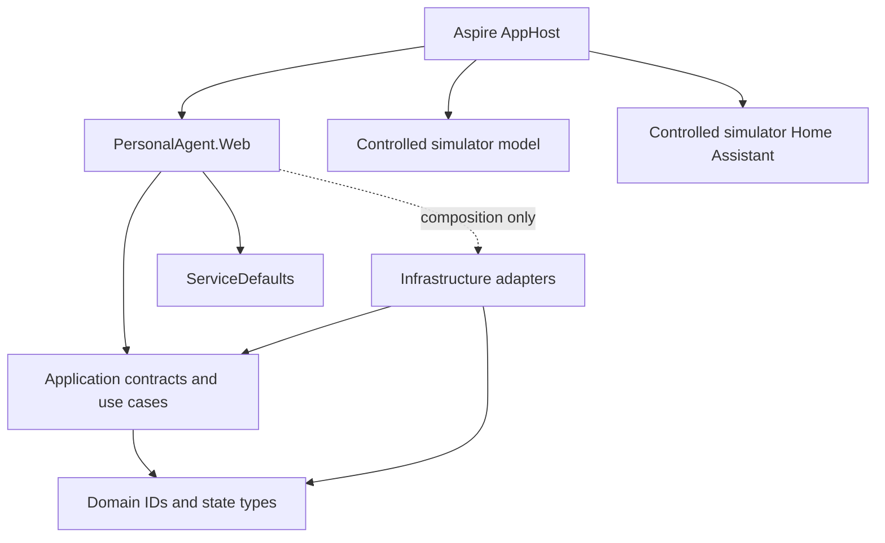

# Architecture and boundaries

## Runtime ownership

The C# host owns user identity, route policy, privacy/context selection,
approval, tool authorization, durable conversations/jobs/audit, cancellation,
and outcome reporting. The Copilot runtime is a replaceable inference engine,
not the authority for application state. SQLite is the intended durable store;
schema and repository work belongs to T03.

## Project boundaries

| Project | Responsibility | Internal dependencies |
| --- | --- | --- |
| Domain | Strong IDs and core state types | None |
| Application | Frozen use-case and adapter contracts, typed events | Domain |
| Infrastructure | SQLite persistence, migrations, backup/restore, and provider/device adapters | Application, Domain |
| Web | Razor host and composition root | Application, Domain, ServiceDefaults; Infrastructure only in composition |
| ServiceDefaults | Health, service discovery and filtered local telemetry | No application projects |
| AppHost | Aspire resource graph and trusted profiles | Web and simulator resource references only |
| Test projects | Verification and deterministic fixtures | Tested projects and TestSupport only |

Domain/Application do not depend on ASP.NET Core, Aspire, SQLite/EF, Copilot or
provider SDKs. In production, all `GitHub.Copilot` types and package
references are restricted to `Infrastructure/AgentEngine/Copilot`; the
separate `tools/sdk-validation` feasibility harness is the documented
pre-T02 exception. Web request handlers must call Application contracts
rather than raw database, provider or Home Assistant clients. The architecture
tests enforce direct project edges, compiled assembly/type dependencies,
Copilot adapter namespaces, and the Web composition exception.

## Durable storage ownership

SQLite is the authoritative store for application conversations, turns and
events, explicit memory facts/proposals, approval and action journals, jobs and
runs, notifications, cloud consents, and audit events. `Infrastructure` owns
the schema and numbered transactional migrations; the application-facing
conversation, memory, and job contracts are implemented by SQLite repositories.
Storage-only approval/action/audit journal primitives remain in Infrastructure
until their consuming application use cases are implemented. Neither Domain nor
Application exposes SQLite types.

Connections enable foreign keys and WAL. UTC instants use invariant round-trip
text, versioned writes use SQL compare-and-swap, and FTS5 indexes memory fields.
Online backup/restore uses SQLite's backup API and validates integrity before
replacement. Restore requires stopped workers and closed database connections;
unknown action states remain data and are never replayed by storage.

Conversation retention defaults to 90 days of inactivity and audit retention
to 30 days. Validated positive owner overrides are supported. Retention removes
conversation roots (and cascading messages/turn history) and old audit events;
it does not delete durable facts, jobs, action journals, or unknown outcomes.
The Web composition root is not yet wired to these stores; this persistence
slice provides the schema and adapters for later use-case integration.

## Turn and privacy model

The application owns a stable `TurnId` independent of Copilot runtime session
IDs. Events use UTC observation times and typed outcomes. `Interrupted` is not
success: a child process stopping or a request timing out after a side effect
must not be described as a confirmed failure or automatically retried.

Model proposals are untrusted data. A future dispatcher validates typed
arguments, applies host policy, journals before writes, requires exact consent
where specified, and reports uncertain physical outcomes explicitly. Cloud
context must be a minimal inspectable packet bound to the chosen provider and
consent; neither the Local profile nor an SDK flag is an air-gap claim.

## Aspire resource ownership

AppHost owns only processes it launches. The Simulator/E2E profiles start Web
and deterministic model/HA fixture processes with random managed endpoints.
They explicitly clear external provider and Home Assistant endpoint/secret
references for Web rather than forwarding developer credentials.
Simulator data is persistent beneath the user's application data directory;
E2E requires a unique, test-owned temporary directory. AppHost never stops or
deletes external Ollama, Home Assistant, or real developer data. SQLite is a
file, not a database container.
