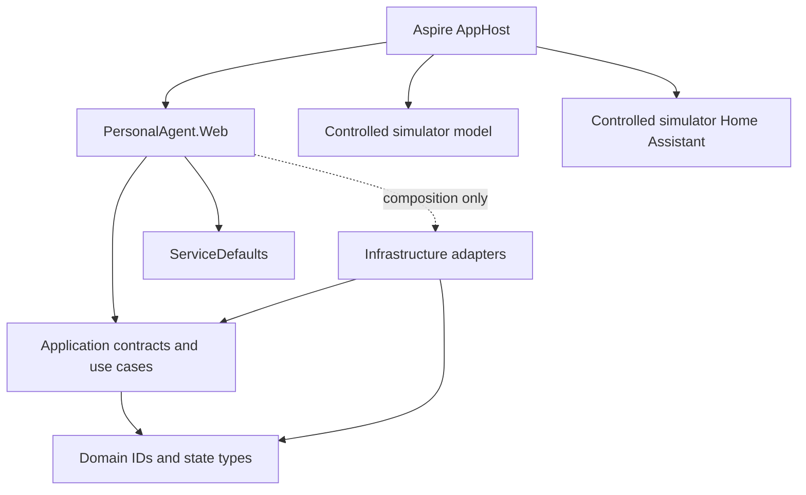

# Architecture and boundaries

## Runtime ownership

The C# host owns user identity, route policy, privacy/context selection,
approval, tool authorization, durable conversations/jobs/audit, cancellation,
and outcome reporting. The Copilot runtime is a replaceable inference engine,
not the authority for application state. SQLite is the durable store;
schema and repository implementation is delivered by T03.

## Project boundaries

| Project | Responsibility | Internal dependencies |
| --- | --- | --- |
| Domain | Strong IDs and core state types | None |
| Application | Frozen use-case and adapter contracts, typed events | Domain |
| Infrastructure | SQLite persistence and provider/device adapters | Application, Domain |
| Web | Razor host and composition root | Application, Domain, ServiceDefaults; Infrastructure only in composition |
| ServiceDefaults | Health, service discovery and filtered local telemetry | No application projects |
| AppHost | Aspire resource graph and trusted profiles | Web and simulator resource references only |
| Test projects | Verification and deterministic fixtures | Tested projects and TestSupport only |

Domain/Application do not depend on ASP.NET Core, Aspire, SQLite/EF, Copilot or
provider SDKs. In production, all `GitHub.Copilot` types and package
references are restricted to `Infrastructure/AgentEngine/Copilot`; the
separate `tools/sdk-validation` feasibility harness is the documented
pre-T02 exception. Web request handlers must call Application contracts
rather than raw database, provider or Home Assistant clients. The architecture
tests enforce direct project edges, compiled assembly/type dependencies,
Copilot adapter namespaces, and the Web composition exception.

## Turn and privacy model

The application owns a stable `TurnId` independent of Copilot runtime session
IDs. Events use UTC observation times and typed outcomes. `Interrupted` is not
success: a child process stopping or a request timing out after a side effect
must not be described as a confirmed failure or automatically retried.

Model proposals are untrusted data. A future dispatcher validates typed
arguments, applies host policy, journals before writes, requires exact consent
where specified, and reports uncertain physical outcomes explicitly. Cloud
context must be a minimal inspectable packet bound to the chosen provider and
consent; neither the Local profile nor an SDK flag is an air-gap claim.

M1 registers `LocalOnlyModelRouter` and `ConversationContextBuilder` as
Application services. The router returns typed Local, Clarify, or Unsupported
decisions with stable reason codes; cloud modes and cloud-required workflows
are rejected instead of silently downgraded. Task categories must be selected
by the host; missing or ambiguous classification clarifies rather than
defaulting user text to a supported workflow. The context builder reads only
bounded recent messages through `IConversationStore`, includes each as
untrusted, provenance-labelled `LocalOnly` data, and adds the current task as
the final item. System-role and tool-role messages are not treated as host
instructions. It reads one extra history row to indicate when additional
older history was truncated, without loading an unbounded transcript. Its
turn-aware read is bounded by the current accepted user-message ID: later
submissions cannot enter or displace earlier context. Completed answers belong
to their originating turn, even when appended after the current submission;
history is ordered by turn acceptance and then by message order within the turn.
Its
`MinimumOmittedHistoryMessages` is a known lower bound, not the full count;
`HasMoreHistory` separately reports when the sentinel proves older rows exist.
Its
estimate includes host instructions, task text, serialized
tool definitions, conversation history and packet framing. Without a provider
tokenizer it reports a four-UTF-16-characters-per-token estimate plus a 20%
reserve, not an exact count. These M1 policies do not implement cloud consent,
memory retrieval or tool execution.

`LocalTurnCoordinator` is the Application-owned lifecycle boundary for local
turns. It transactionally accepts the request, user message, durable
per-conversation request ID and initial event before queueing. SQLite is the
authority for request deduplication and ordered event replay; the bounded
in-memory queue is replaceable and never reconstructs model work after restart.
The coordinator caps execution at four turns globally, serializes turns for
each conversation, and allows at most 20 queued submissions. Queue overflow is
explicit. Same-conversation waiters remain queued and do not occupy execution
workers or release their queue slots; a different conversation can use an
available worker.
Same-conversation work retains acceptance order in a removable pending set.
The bounded notification channel carries only wake-up bytes, never requests.
Persisting cancellation or expiry removes pending work, and its deadline
monitor disposes resources before releasing the reservation, independently of
execution workers. Owner cancellation waits for that cleanup.
The default interactive turn deadline is 120 seconds from
durable acceptance, including queue wait, routing, context construction, and
inference; the engine receives only the remaining budget and a separate
deadline-cancellation token so timeout remains distinct from owner cancellation.
Trusted host configuration may bound a provider/model override. User cancellation is
`Cancelled`; host shutdown, deadline expiry, process failure, or uncertain
cleanup is `Interrupted`.
The coordinator selects one winning cancellation cause; only that cause may
signal the engine, including direct engine cancellation/shutdown. It publishes
the winning engine signal before waking routing/context cleanup and defers
resource disposal during reentrant cancellation publication. Delayed cleanup
or a concurrent losing signal cannot reclassify the outcome.
Failed or cancelled workers/deadline monitors
make readiness unhealthy and reject new submissions before durable creation.
Clarification decisions are persisted
as terminal `TurnClarificationRequired` events with their safe owner-facing
message; unsupported routes persist a safe limitation message. Final assistant
content, terminal state, and terminal event commit atomically. Startup marks
every persisted nonterminal turn interrupted instead of replaying inference.
Readiness checks SQLite reachability and the applied schema version separately
from local provider configuration; model connectivity is not probed.

T04's `CopilotAgentEngine` creates a fresh SDK client/session and dedicated
runtime/work directory for each turn. It uses empty SDK mode, explicit
provider configuration, disabled logged-in-user discovery, a sanitized child
environment, and only the caller's registered tool catalog. Every tool
callback goes through `IToolDispatcher`; the engine does not provide tool
authorization. Typed events are appended through `IConversationStore` before
they are yielded, so persistent per-turn sequence numbers are the replay
cursor. Terminal status and its terminal event are committed atomically using
the stored expected version. Deadlines
bound SDK waits and abort/stop are bounded; timeout and process cleanup
uncertainty are reported as interruption. The per-turn SDK runtime/workspace
directory is removed after shutdown, with cleanup failures surfaced as
interruption. Terminal persistence has a separate bounded timeout so
cancellation cannot skip the durable outcome. Event persistence observes the
turn token; force-stop and disposal share one shutdown task, preventing
disposal or directory removal from racing a timed-out stop. The native runtime
remains a trusted dependency under ADR 0001, not an OS-isolated process.

## Aspire resource ownership

AppHost owns only processes it launches. The Simulator/E2E profiles start Web
and deterministic model/HA fixture processes with random managed endpoints.
Web uses the Aspire-discovered loopback model fixture as its local
OpenAI-compatible provider and explicitly clears cloud and Home Assistant
endpoint/secret references rather than forwarding developer credentials.
Simulator data is persistent beneath the user's application data directory;
E2E requires a unique, test-owned temporary directory. AppHost never stops or
deletes external Ollama, Home Assistant, or real developer data. SQLite is a
file, not a database container.

## SQLite storage ownership

`PersonalAgent.Infrastructure.Persistence` owns the SQLite file, forward-only
schema migrations, FTS5 synchronization, and implementations of the
Application storage contracts. Conversation storage includes messages, turns,
and ordered event cursors; memory, jobs, approvals, action journals, and audit
use separate storage operations. Web composition selects `JARVIS_DATA_DIR` (or
the per-user LocalApplicationData `Jarvis` directory when unset). It reuses
the previous AppHost `PersonalAgent` location only when that is the sole
default database; if both default locations contain data, startup requires an
explicit path. AppHost leaves the Local/Hybrid fallback to Web so both launch
modes resolve the same store. The database file is `jarvis.db`, outside the
deployment folder. `Microsoft.Data.Sqlite` is confined to Infrastructure and
integration tests. Domain and Application remain independent of SQLite.

Migrations use SQLite `user_version` and apply each embedded SQL migration
inside its own immediate transaction. Foreign keys are enabled per connection;
WAL is enabled during startup. Apply pending upgrades to a SQLite backup copy
before swapping application binaries. Schema downgrade is not automatic: a
rollback restores a matched backup and prior binary.

`SqliteBackupRestoreService` uses SQLite's online backup facility and verifies
integrity plus foreign keys. Restore first copies the backup, migrates and
validates that copy, then replaces the database file. Stop the Web host and
all workers before restoring; no database connection or active worker may
remain open. Restore does not run jobs or replay an action, and preserves
recorded `Unknown` action outcomes. Backups can retain logically deleted data;
SQLite file-page secure erasure is not claimed.

The Web host applies validated retention settings at startup:
`JARVIS_CONVERSATION_RETENTION_DAYS` defaults to 90 days and
`JARVIS_AUDIT_RETENTION_DAYS` defaults to 30 days (each accepts 1–3650 days).
Cleanup deletes old conversation roots and their dependent messages/turn
events, and expired audit events. It does not purge durable memory facts,
jobs, actions, approvals, or uncertain outcomes.
